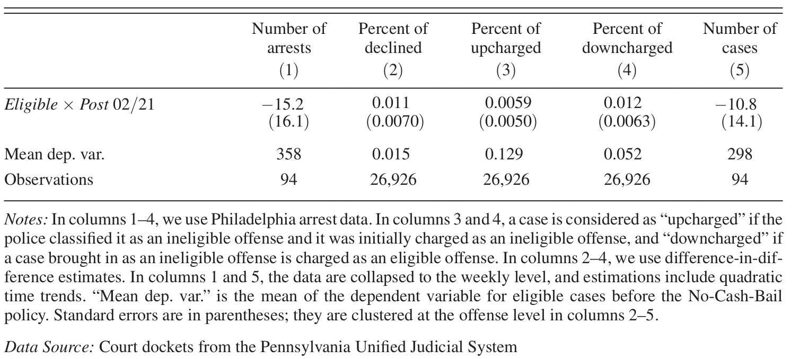

```{r setup, include=FALSE}
knitr::opts_chunk$set(echo = FALSE, warning = FALSE, message = FALSE)
library(tidyverse)
library(fixest)
library(haven)
library(gt)
library(ggh4x)
library(modelsummary)
library(gtsummary)
library(DoubleML)
library(kableExtra)
library(cowplot)
library(NuisanceParameters)
library(hdm)
library(broom)
```

```{r}
master_data <- read_stata("CashBail.dta")
master_data$baildate <- as.Date(master_data$baildate, origin = "1960-01-01")
```

## 1.1 Differences-in-Differences

Difference-in-Differences is a causal inference method used on observed data (i.e. not experimental setting) to estimate causal effects. It does so by comparing the changes in outcomes over time between a population that is enrolled in a program (the Treatment Group) and a population that is not (the Control Group). The intuition is the following: We want to know what would have happened to the treated units had they not been treated. Since we cannot observe this counterfactual, we use the trend of the control group as a proxy for what the treated group's trend would have been.

### Identification

$$
\begin{aligned}
\mathbb{E}[Y_2 \mid W = 1] - \mathbb{E}[Y_1 \mid W = 1] &\stackrel{\text{consistency}}{=} \mathbb{E}[Y_2(1) \mid W = 1] - \mathbb{E}[Y_1(1) \mid W = 1] \\
&= \mathbb{E}[Y_2(1) - Y_1(1) \mid W = 1] + \color{blue}{\mathbb{E}[Y_2(0) - Y_2(0) \mid W = 1]} + \color{blue}{\mathbb{E}[Y_1(0) - Y_1(0) \mid W = 1]} \\
&= \underbrace{\mathbb{E}[Y_2(1) - Y_2(0) \mid W = 1]}_{\tau_{ATT}} + \underbrace{\mathbb{E}[Y_2(0) - Y_1(0) \mid W = 1]}_{\text{counterfactual time trend}} - \underbrace{\mathbb{E}[Y_1(1) - Y_1(0) \mid W = 1]}_{\text{anticipation effect}}
\end{aligned}
$$

Unlike standard Cross-Sectional OLS, which relies on the unconfoundedness assumption ($Y(0), Y(1) \perp W \mid X$), DiD relaxes this requirement. It allows for selection bias—where individuals choose treatment based on unobserved characteristics—provided that these unobserved factors are time-invariant, and the parallel trends and no-anticipation effect assumptions hold.

The former requires trends in the absence of treatment to be parallel, i.e. $\mathbb{E}[Y_2(0) - Y_1(0) \mid W=1]=\mathbb{E}[Y_2(0) - Y_1(0) \mid W=0]$.

The no-anticipation effect assumption requires that the outcomes of the treatment group are only affected by the treatment after the treatment is given, i.e., $$\mathbb{E}[Y_1(1) - Y_1(0) \mid W=1] = 0$$.

The downside of not needing the unconfoundedness assumption is that we can only identify the ATT, not the ATU or ATE. This is the case because we do not assume parallel trends under treatment, i.e., $\mathbb{E}[Y_2(1) - Y_1(1) \mid W=1]=\mathbb{E}[Y_2(1) - Y_1(1) \mid W=0]$. In other words, the control group might be different in some unobserved confounders which make treatment effects heterogeneous from the treatment group.

In practice researchers often rely on conditional parallel trends. This assumption acknowledges that treatment and control groups may have different compositions (e.g., age or gender distributions) that naturally lead to diverging trends. Therefore trends are parallel only after adjusting for these covariates. Furthermore, with repeated cross-sectional data researcher control for relevant covariates in order to account for potential group-composition shifts between periods.

## 1.2 Custom Double ML DiD Function

## 1.3a Replication of Ouss and Stevenson (2023)

### 1.3a.2 Descriptives

#### Cash Bail System

The paper “Does Cash Bail Deter Misconduct?” (Ouss and Stevenson, 2023) investigates how cash bails affect the likelihood of a defendant violating the bail conditions. Cash bailout refers to a financial collateral the defendant must pay to remain out of jail while they await their trial. If the defendant fulfils the bail conditions they get their collateral back. The conditions which need to be fulfilled in order for the defendant to get the cash bail back after the court trials are over:

-   **Appearing to all hearings**
-   **Not committing another crime**

If an individual violates either of these conditions, they lose the bail collateral. Furthermore, if an individual does not even pay the collateral in the beginning, they are detained in jail until the court trials are over.

The cash bail system thus is supposed to ensure individuals appear for the hearings and don’t commit further crimes through a monetary incentive. Thus individuals who do not pay the bail collateral are jailed, because the lack of monetary incentive would make it more likely for them to violate the conditions.

#### Policy Reform

The reform analysed in this paper is a change in the policy of Philadelphia’s public prosecutors, who in February 2018 recommended to no longer require cash-bail for many low-level offenses. The motivation of this and similar reforms in other jurisdictions is to protect economically vulnerable, often minority groups which cannot afford to post cash-bail. If the cash-bail system is successful in motivating individuals to not violate the bail conditions, then releasing defendants without financial incentive should lead to more violations. This paper thus uses DiD to investigate whether eligible defenders (i.e. defenders eligible for the new bail policy, who committed low-level crimes) who now no longer need to post bail are after the reform more likely to miss court hearings and commit further crimes.

Importantly, the reform entailed the Philadelphia prosecutor only recommending this change in bail policy instead of simply deciding, because the decision whether and how much cash-bail is required is made by bail magistrates, who have the ultimate discretion here. While this discretion with magistrates makes it thus imaginable that this reform did not actually change anything, figure 1 shows that the share of defendants released without cash-bail (the correct legal term being Release on own Recognizance, or ROR) increased significantly, by around 15-20 percentage points. In the replication section, we will test this increase in ROR also through a DiD design. We can thus confirm that the reform had significant measure effects, which the authors argue were not result of a change in formal rules, but rather of a change in norms.

```{r}
data_trends_ov <- master_data %>%
  filter(EligibleOffense == 1) %>%
  mutate(
    days_rel = as.numeric(baildate - as.Date("2018-02-22")),
    
    W2 = ifelse(days_rel >= 0, floor(days_rel / 14), floor((days_rel + 1) / 14) - 1)
  )

biweekly_avg <- data_trends_ov %>%
  group_by(W2, EligibleOffense) %>%
  summarise(
    ROR = mean(ROR, na.rm = TRUE),
    Jail = mean(Jail3days, na.rm = TRUE),
    FTA = mean(hasfta, na.rm = TRUE),
    Recidivism = mean(Rec6mo, na.rm = TRUE),
    .groups = "drop"
  ) %>%
 
  filter(W2 >= -12 & W2 <= 12 & W2 != 0) %>%
  pivot_longer(cols = c(ROR, Jail, FTA, Recidivism), names_to = "Outcome", values_to = "Rate")

scales_y <- list(
  Outcome == "ROR" ~ scale_y_continuous(limits = c(0.4, 0.8), breaks = seq(0.4, 0.8, 0.1)),
  Outcome == "Jail" ~ scale_y_continuous(limits = c(0, 0.4), breaks = seq(0, 0.4, 0.1)),
  Outcome == "FTA" ~ scale_y_continuous(limits = c(0, 0.4), breaks = seq(0, 0.4, 0.1)),
  Outcome == "Recidivism" ~ scale_y_continuous(limits = c(0, 0.4), breaks = seq(0, 0.4, 0.1))
)

biweekly_avg <- biweekly_avg %>%
  mutate(Outcome = factor(Outcome, levels = c("ROR", "Jail", "FTA", "Recidivism")))

# ggplot(biweekly_avg, aes(x = W2, y = Rate)) +
#   geom_point(color = "grey70", size = 1.5) +
#   
#   
#   geom_smooth(data = subset(biweekly_avg, W2 < 0), 
#               method = "lm", formula = y ~ poly(x, 2), 
#               se = FALSE, color = "black", size = 0.8) +
#   
#   geom_smooth(data = subset(biweekly_avg, W2 > 0), 
#               method = "lm", formula = y ~ poly(x, 2), 
#               se = FALSE, color = "black", size = 0.8) +
#   
#   geom_vline(xintercept = 0, linetype = "dashed", color = "grey30") +
#   
#   facet_wrap(~Outcome, scales = "free_y") +
#   
#   facetted_pos_scales(y = scales_y) +
#   
#   scale_x_continuous(breaks = seq(-12, 12, 4), 
#                      labels = function(x) x / 2) +
#   
#   theme_minimal() +
#   labs(x = "Months relative to Feb. 22",
#        y = "Bi-weekly Rate") +
#   theme(panel.grid.minor = element_blank())
        
```

```{r}
# Figure 1a: ROR Time Trend
p_eligible <- ggplot(subset(biweekly_avg, Outcome == "ROR"), aes(x = W2, y = Rate)) +
  geom_point(color = "grey70", size = 1.5) +
  
  
  geom_smooth(data = subset(biweekly_avg, W2 < 0 & Outcome == "ROR"), 
              method = "lm", formula = y ~ poly(x, 2), 
              se = FALSE, color = "black", size = 0.8) +
  
  geom_smooth(data = subset(biweekly_avg, W2 > 0 & Outcome == "ROR"), 
              method = "lm", formula = y ~ poly(x, 2), 
              se = FALSE, color = "black", size = 0.8) +
  
  geom_vline(xintercept = 0, linetype = "dashed", color = "grey30") +
  
  scale_y_continuous(limits = c(0.4, 0.8), breaks = seq(0.4, 0.8, 0.1)) +
  
  scale_x_continuous(breaks = seq(-12, 12, 4), 
                     labels = function(x) x / 2) +
  
  
  theme_minimal() +
  labs(title = "ROR",
       subtitle = "(Eligible Cases)",
    x = "Months relative to Feb. 22",
       y = "Bi-weekly ROR Rate") +
  theme(panel.grid.minor = element_blank(),
        plot.title = element_text(hjust = 0.5)) + 
  theme(
    plot.title = element_text(hjust = 0.5, face = "bold", size = 12),
    plot.subtitle = element_text(hjust = 0.5, size = 10),
    panel.grid.minor = element_blank()
  )
```

```{r}

# Figure 1c: ROR for Ineligible Cases
data_inel <- master_data %>%
  filter(EligibleOffense == 0) %>%
  mutate(
    days_rel = as.numeric(baildate - as.Date("2018-02-22")),

    W2 = ifelse(days_rel >= 0, floor(days_rel / 14), floor((days_rel + 1) / 14) - 1)
  )

# Bi-weekly ROR Rate
biweekly_ror_inel <- data_inel %>%
  group_by(W2) %>%
  summarise(Rate = mean(ROR, na.rm = TRUE), .groups = "drop") %>%
  filter(W2 >= -12 & W2 <= 11)

p_ineligible <- ggplot(biweekly_ror_inel, aes(x = W2, y = Rate)) +
 
  geom_point(color = "grey70", size = 1.2) +
  
  geom_smooth(data = filter(biweekly_ror_inel, W2 < 0), 
              method = "lm", formula = y ~ poly(x, 2), 
              se = FALSE, color = "grey30", size = 0.8) +
  
  geom_smooth(data = filter(biweekly_ror_inel, W2 >= 0), 
              method = "lm", formula = y ~ poly(x, 2), 
              se = FALSE, color = "grey30", size = 0.8) +
  
  geom_vline(xintercept = 0, linetype = "dashed", color = "grey30") +
  
  scale_y_continuous(limits = c(0, 0.4), breaks = seq(0, 0.4, 0.1)) +
  
  scale_x_continuous(breaks = seq(-12, 12, 4), 
                     labels = function(x) x / 2) +
  
  theme_minimal() +
  labs(title = "ROR", 
       subtitle = "(Ineligible Cases)",
       x = "Months relative to Feb. 22", 
       y = "Bi-weekly ROR rate") +
  theme(
    plot.title = element_text(hjust = 0.5, face = "bold", size = 12),
    plot.subtitle = element_text(hjust = 0.5, size = 10),
    panel.grid.minor = element_blank()
  )
  
```

```{r}

plot_grid(p_eligible, p_ineligible,
          ncol = 2, nrow = 1)

```

*Figure 1a: ROR Time Trend for eligible (left) and ineligible right) cases*

#### Target Parameters and Controls

The authors scraped the data for this analysis off the Philadelphia court websites. The auxiliary target parameters are:

-   **Release on Recognizance (ROR):** Whether a defendant is released without monetary bail or supervisory conditions. As explained in the prior section, measuring ROR is necessary to confirm that the policy actually changed bail-setting behavior.
-   **Pretrial Detention:** Defined as spending at least three nights in jail immediately following the initial bail hearing. The DiD will later show that the amount of individuals detained before trial was not affected by the reform. This will be used to argue that any reform affects on the FTA and recidivism variables must be due to the monetary incentive channel and not the detainment channel.

The target parameters of the main DiD analysis are:

-   **Failure to Appear (FTA):** Defined as equal to one if the defendant fails to appear for at least one court date associated with the case.
-   **Recidivism:** Defined as equal to one if the defendant is charged with a new offense within six months of the bail hearing.

Both of these main target parameters make up the conditions which cannot be violated if the defendant wants to keep their bail money.

To account for case and defendant characteristics, the authors include the following controls in the DiD analyses:

-   **Defendant Demographics:** Race, gender, and age at arrest.
-   **Criminal History:** The presence and number of prior FTAs and prior convictions (limited to a nine-year window before the bail hearing),,.
-   **Case Characteristics:** The type of offense (aggregated to the 23 most common offenses plus a catchall category), the grade of offense, and whether the defendant was represented by a public defender.
-   **Procedural Factors:** The specific bail magistrate overseeing the hearing, the day of the week, and the magistrate work shift.
-   **Standard errors:** in these analyses are clustered at the offense level to account for correlations within offense types.

### 1.3a.3 Replication Results

#### DiD TWFE

$$
(1) \quad Y_{i} = \alpha + \beta Post_{i} + \delta Post_{i} \times Eligible_{i} + \lambda Eligible_{i} + \theta \mathbf{X}_{i} + \epsilon_{i}.
$$

Equation (1) specifies the paper’s DiD regression, where Y is one of the 4 target parameters, i indicates the specific case, Post the post-treatment period and Eligible that an individual is part of the treatment group affected by the reform. The covariates used are the described above in the section target parameters and controls. The main coefficient of interest is δ. The authors do not include individual level fixed effects because we are in a cross-sectional setting. Instead we have one time fixed effect (Post) and one group fixed effect (eligible). We replicate the TWFE in the paper ourselves to double check that we have the data set up correctly in order for the double ML estimation to be comparable.

```{r}
## Data Preparation
did_twfe <- master_data %>%
  mutate(
    yq_numeric = as.numeric(as.factor(yq)),
    # Creating past_fel from prior_fel 
    past_fel = as.numeric(prior_fel > 0),
    
    # Creating Denied 
    Denied = as.numeric(initialbailtype == "Denied"),
    
    # Addressing NAs
    income_missing = as.numeric(is.na(defendantzipmedianhouseholdincom)),
    poverty_missing = as.numeric(is.na(PctBelPov)),
    
    defendantzipmedianhouseholdincom = ifelse(is.na(defendantzipmedianhouseholdincom), 
                                              mean(defendantzipmedianhouseholdincom, na.rm = TRUE), 
                                              defendantzipmedianhouseholdincom),
    
    PctBelPov = ifelse(is.na(PctBelPov), 
                       mean(PctBelPov, na.rm = TRUE), 
                       PctBelPov),
    
    # Re-calculate or ensure PostElig is correct
    PostElig = EligibleOffense * Post,
  
    off = as.factor(off),
    yq = as.factor(yq),
    DOW = as.factor(DOW), 
    CommissionerName_input = as.factor(CommissionerName_input) 
  )

covariates <- c("defendantageatarrest", "male", "defendantisblack", "Hisp", 
                "White", "defendantzipmedianhouseholdincom", "PctBelPov", 
                "PD", "felony", "prior_FTA", "prior_9y", "past_fel", "income_missing", "poverty_missing")

# Column 1: ROR (No controls)
res_ror_1 <- feols(ROR ~ PostElig + EligibleOffense + Post, 
                   cluster = ~off, data = did_twfe)

# Column 2: ROR (With controls and Fixed Effects)
res_ror_2 <- feols(ROR ~ PostElig + Post + .[covariates] | off + yq, 
                   cluster = ~off, data = did_twfe)

# Column 3: Jail (No controls)
res_jail_3 <- feols(Jail3days ~ PostElig + EligibleOffense + Post, 
                    cluster = ~off, data = did_twfe)

# Column 4: Jail (With controls and Fixed Effects)
res_jail_4 <- feols(Jail3days ~ PostElig + Post + .[covariates] | off + yq, 
                    cluster = ~off, data = did_twfe)

## Pre-period Means & Models
mean_ror_pre <- master_data %>% 
  filter(EligibleOffense == 1, Post == 0) %>% 
  summarise(mean = mean(ROR, na.rm = TRUE)) %>% pull(mean)

mean_jail_pre <- master_data %>% 
  filter(EligibleOffense == 1, Post == 0) %>% 
  summarise(mean = mean(Jail3days, na.rm = TRUE)) %>% pull(mean)

# Model (1): ROR No Controls
m1 <- feols(ROR ~ PostElig + Post + EligibleOffense, cluster = ~off, data = did_twfe)

# Model (2): ROR With Controls & Fixed Effects
m2 <- feols(ROR ~ PostElig + Post + .[covariates] | off + yq, cluster = ~off, data = did_twfe)

# Model (3): Jail No Controls
m3 <- feols(Jail3days ~ PostElig + Post + EligibleOffense, cluster = ~off, data = did_twfe)

# Model (4): Jail With Controls & Fixed Effects
m4 <- feols(Jail3days ~ PostElig + Post + .[covariates] | off + yq, cluster = ~off, data = did_twfe)

## SUMMARY TABLE

table_3 <- etable(m1, m2, m3, m4,
       headers = list("ROR" = 2, "Jail" = 2),
       dict = c(PostElig = "Eligible x Post 02/21"),
       keep = "Eligible x Post 02/21",
       
       extralines = list(
         "Controls"      = c("No", "Yes", "No", "Yes"),
         "Mean dep. var." = c(round(mean_ror_pre, 3), round(mean_ror_pre, 3), 
                             round(mean_jail_pre, 3), round(mean_jail_pre, 3))
       ),
      
       digits = 4, 
       digits.stats = "r0", 
       fitstat = ~n,     
       style.df = style.df(depvar.title = "", fixef.suffix = ""),
       notes = "Standard errors, clustered at the offense level, are in parentheses."
)

mean_fta_pre <- master_data %>% 
  filter(EligibleOffense == 1, Post == 0) %>% 
  summarise(mean = mean(hasfta, na.rm = TRUE)) %>% pull(mean)

mean_rec_pre <- master_data %>% 
  filter(EligibleOffense == 1, Post == 0) %>% 
  summarise(mean = mean(Rec6mo, na.rm = TRUE)) %>% pull(mean)

# Model (1): FTA No Controls
m5_1 <- feols(hasfta ~ PostElig + Post + EligibleOffense, cluster = ~off, data = did_twfe)

# Model (2): FTA With Controls & Fixed Effects
m5_2 <- feols(hasfta ~ PostElig + Post + .[covariates] | off + yq, 
              cluster = ~off, data = did_twfe)

# Model (3): Recidivism No Controls
m5_3 <- feols(Rec6mo ~ PostElig + Post + EligibleOffense, cluster = ~off, data = did_twfe)

# Model (4): Recidivism With Controls & Fixed Effects
m5_4 <- feols(Rec6mo ~ PostElig + Post + .[covariates] | off + yq, 
              cluster = ~off, data = did_twfe)

#  SUMMARY TABLE 5
table_5 <- etable(m5_1, m5_2, m5_3, m5_4,
       headers = list("FTA" = 2, "Recidivism" = 2),
       dict = c(PostElig = "Eligible x Post 02/21"),
       keep = "Eligible x Post 02/21",
       extralines = list(
         "Controls"      = c("No", "Yes", "No", "Yes"),
         "Mean dep. var." = c(round(mean_fta_pre, 3), round(mean_fta_pre, 3), 
                             round(mean_rec_pre, 3), round(mean_rec_pre, 3))
       ),
       digits = 4, 
       digits.stats = "r0",
       fitstat = ~n,
       style.df = style.df(depvar.title = "", fixef.suffix = ""),
       notes = "Standard errors, clustered at the offense level, are in parentheses."
)

```

```{r}
table_6 <- etable(
  m2, m4, m5_2, m5_4,
  dict = c(PostElig = "Eligible x Post 02/21"),
  keep = "Eligible x Post 02/21",
  extralines = list(
    "Mean dep. var." = c(round(mean_ror_pre, 3),
                         round(mean_jail_pre, 3),
                         round(mean_fta_pre, 3),
                         round(mean_rec_pre, 3))
  ),
  digits = 4,
  digits.stats = "r0",
  fitstat = ~n,
  style.df = style.df(depvar.title = "", fixef.suffix = ""),
  notes = "Standard errors, clustered at the offense level, are in parentheses."
)

# Render with kableExtra for a clean academic look
library(kableExtra)

table_6 %>%
  as.data.frame() %>%
  kbl(#caption = "Table 1: DiD Estimates of ROR, Jail, FTA, and Recidivism",
      booktabs = TRUE, 
      align = "lcccc",
      # This removes the extra column name row kable sometimes adds
      col.names = c("Characteristic", "ROR", "Jail", "FTA", "Recidivism")) %>%
  kable_classic(full_width = F, html_font = "Cambria") 

```

*Table 1*: DiD Estimates of ROR, Jail, FTA, and Recidivism

We will not interpret these TWFE DiD results by themselves here, but rather use them to benchmark our Double ML result in the following section.

#### DiD Double ML

We observe $(Y_i, D_i, T_i, X_i)$ where $D_i \in \{0,1\}$ is the treatment variable and $T_i \in \{0,1\}$ is the time variable. ATT is identified in repeated cross sectional DiD under parallel trend and standard overlap assumption.

For the Double ML estimation we use the same dataset with the same target parameters and covariates as in the TWFE implementation.\
Here now a brief explanation of how we constructed the custom Double ML function: We observe $(Y_i, D_i, T_i, X_i)$ where $D_i \in \{0,1\}$ is the treatment variable and $T_i \in \{0,1\}$ is the time variable. The parameter of interest is the ATT (average treatment effect on the treated): $$\theta_0 = E[(Y(1)_{i} - Y(0)_{i}| D=1, \, T=1 ]$$ identified in Cross Sectional DiD under parallel trend and standard overlap assumption.

We use a doubly robust pooled cross section score to get the parameter estimate $\hat{\theta}$ as well as the influence function $\hat{\psi}(\theta)$. To get the score we need to estimate the nuisance parameters: $$m_0(X) = P(D=1|X)$$ as well as the outcome regressions for each cell $(d,t)$ which is

$$g_{dt,0}(X) = E[Y|D=d, T=t,X]$$

with the given nuisance parameter function. Since the given function does not allow to conditioning on $(D,T,X)$ we constructed a workaround such that we can get $\hat{g}_{11}(X),\hat{g}_{01}(X), \hat{g}_{10}(X), \hat{g}_{00}(X)$. We estimate that by turning $(D,T)$ into a 4-category variable `DT_combined <- 2 * D + Tt`. We used random forests stacked with lasso to estimate the CEF's for the outcome and random forests stacked with logit for the propensity score.

We then constructed $\psi_a$ and $\psi_b$ based on the score provided by the [DoubleML](https://docs.doubleml.org/stable/guide/scores.html#id4) documentation. Using this we identify $\theta$ by solving the linear moment equation:

$$ 
E[\psi_a \theta_{0} + \psi_b] = 0 \Rightarrow \theta_{0} = - \frac{E_i[\psi_b]}{E_i[\psi_a]}
$$ To get estimates of $\theta$, we replaced the population averages with sample means. Afterward we constructed the influence function

$$ IF_i = \frac{-1}{E[\psi_a]} \cdot \psi_i(\hat{\theta})$$

To estimate is, we also replaced the population averages with sample means. We then used the estimated values for the influence function to get standard error for our ATT estimator. To recover clustered variance, we used

$$
\hat{var}(\hat{\theta}) =  \frac{1}{n}\sum_{k=1}^{C} \left(\sum_{i \in G_{k}} IF_{i}\right)^{2}
$$

where C is the number of clusters and $G_{k}$ is the k-th cluster.

```{r}

doubleML_did_cs_gate <- function(data, y_var, d_var, t_var, x_vars, methods, cf = 5,
                                 feature_eng = FALSE, bin_cut = 0.02, corr_cut = 0.9,
                                 cluster_var = NULL,
                                 heterogeneity = FALSE, gate_var = NULL) {
  
  Y  <- data[[y_var]]
  D  <- as.numeric(data[[d_var]])
  Tt <- as.numeric(data[[t_var]])
  X_0 <- as.matrix(data[, x_vars])
  n  <- length(Y)
  
  if (!is.null(cluster_var)) {
    C <- data[[cluster_var]]
  }
  
  if (feature_eng) {
    X_expanded <- design_matrix(X_0, int = "all", int_d = 2,
                                poly = "all", poly_d = 2)
    X <- data_screen(X_expanded, treat = D,
                     bin_cut = bin_cut, corr_cut = corr_cut,
                     quiet = TRUE)
  } else {
    X <- X_0
  }
  
  # Kombiniertes Treatment: (D,T)
  DT_combined <- 2 * D + Tt
  
  # ---- 1) m(X)
  np_m <- nuisance_parameters(
    NuPa = "D.hat", X = X, D = D,
    methods = methods, cf = cf,
    stacking = "short", stratify = TRUE, ensemble_type = "nnls",
    quiet = TRUE
  )
  m_hat <- as.numeric(np_m$nuisance_parameters$D.hat)
  
  # ---- 2) g(d,t,X)
  np_g <- nuisance_parameters(
    NuPa = "Y.hat.d",
    X = X,
    Y = Y,
    D = DT_combined,
    methods = methods,
    cf = cf,
    stacking = "short",
    stratify = TRUE,
    ensemble_type = "nnls",
    quiet = TRUE
  )
  
  g00_hat <- np_g$nuisance_parameters$Y.hat.d[, 1]  # D=0,T=0
  g01_hat <- np_g$nuisance_parameters$Y.hat.d[, 2]  # D=0,T=1
  g10_hat <- np_g$nuisance_parameters$Y.hat.d[, 3]  # D=1,T=0
  g11_hat <- np_g$nuisance_parameters$Y.hat.d[, 4]  # D=1,T=1
  
  # ---- 3) Score (ATT)
  psi_a <- -D / mean(D)
  
  psi_b <- D / mean(D) * (g11_hat - g10_hat - (g01_hat - g00_hat)) +
    (Tt * D / mean(D * Tt)) * (Y - g11_hat) -
    (D * (1 - Tt) / mean(D * (1 - Tt))) * (Y - g10_hat) -
    (m_hat * (1 - D) * Tt / (1 - m_hat)) /
    mean(m_hat * (1 - D) * Tt / (1 - m_hat)) * (Y - g01_hat) +
    (m_hat * (1 - D) * (1 - Tt) / (1 - m_hat)) /
    mean(m_hat * (1 - D) * (1 - Tt) / (1 - m_hat)) * (Y - g00_hat)
  
  theta_hat <- -mean(psi_b) / mean(psi_a)
  
  psi <- psi_a * theta_hat + psi_b
  influence_fun <- -1 / mean(psi_a) * psi
  
  if (is.null(cluster_var)) {
    se_hat <- sqrt(mean(psi^2) / (mean(psi_a)^2 * n))
    clustered <- FALSE
  } else {
    clusters <- unique(C)
    cluster_sums_squared <- rep(NA_real_, length(clusters))
    index <- 1
    for (cl in clusters) {
      cluster_sums_squared[index] <- sum(influence_fun[C == cl])^2
      index <- index + 1
    }
    var_hat <- 1 / n * sum(cluster_sums_squared)
    se_hat <- sqrt(var_hat / n)
    clustered <- TRUE
  }
  
  # ---- 4) Return object (base)
  out <- list(
    coefficients = c(ATT = theta_hat),
    se = se_hat,
    clustered = clustered,
    t = theta_hat / se_hat,
    p = 2 * (1 - pnorm(abs(theta_hat / se_hat))),
    ci_lower = theta_hat - 1.96 * se_hat,
    ci_upper = theta_hat + 1.96 * se_hat,
    N = n,
    N_treated = sum(D),
    N_control = sum(1 - D),
    N_post = sum(Tt),
    N_pre = sum(1 - Tt),
    y_var = y_var,
    d_var = d_var,
    t_var = t_var,
    x_vars = x_vars,
    n_covariates = ncol(X),
    cf = cf,
    methods = names(methods),
    feature_eng = feature_eng,
    cluster_var = cluster_var
  )
  
  # ------ 5) GATT  -------
  
  if (heterogeneity) {
    
    if (is.null(gate_var)) stop("heterogeneity = TRUE requires gate_var")
    
    G <- as.factor(data[[gate_var]])
    groups <- levels(G)
    
    # containers
    tau_hat <- rep(NA_real_, length(groups))
    names(tau_hat) <- groups
    
    IF_mat <- matrix(NA_real_, nrow = n, ncol = length(groups))
    colnames(IF_mat) <- groups
    
    for (j in seq_along(groups)) {
      g <- groups[j]
      I_g <- as.numeric(G == g)
      
      denom <- mean(I_g * psi_a)
      if (abs(denom) < 1e-12) {
        stop(paste0("Group ", g, " has near-zero denom E[I_g*psi_a]."))
      }
      
      num <- mean(I_g * psi_b)
      tau_hat[g] <- - num / denom
      
      # Influence function for tau_g
      psi_g <- I_g * (psi_a * tau_hat[g] + psi_b)
      IF_mat[, j] <- -1 / denom * psi_g
    }
    
    # SEs using the same logic as ATT, applied per group
    gate_se <- rep(NA_real_, length(groups))
    names(gate_se) <- groups
    
    if (is.null(cluster_var)) {
      for (j in seq_along(groups)) {
        gate_se[j] <- sqrt(mean(IF_mat[, j]^2) / n)
      }
      gate_clustered <- FALSE
    } else {
      clusters <- unique(C)
      for (j in seq_along(groups)) {
        infl <- IF_mat[, j]
        cluster_sums_squared <- rep(NA_real_, length(clusters))
        k <- 1
        for (cl in clusters) {
          cluster_sums_squared[k] <- sum(infl[C == cl])^2
          k <- k + 1
        }
        var_hat_g <- 1 / n * sum(cluster_sums_squared)
        gate_se[j] <- sqrt(var_hat_g / n)
      }
      gate_clustered <- TRUE
    }
    
    gate_t <- tau_hat / gate_se
    gate_p <- 2 * (1 - pnorm(abs(gate_t)))
    
    out$gate <- list(
      tau = tau_hat,
      se = gate_se,
      clustered = gate_clustered,
      t = gate_t,
      p = gate_p,
      ci_lower = tau_hat - 1.96 * gate_se,
      ci_upper = tau_hat + 1.96 * gate_se,
      groups = groups,
      N = n,
      gate_var = gate_var,
      influence_function = IF_mat
    )
  }
  class(out) <- "doubleML_did_cs_gate"
  return(out)
}


```

```{r}
# data preparation 
CashBail <- read_stata("CashBail.dta") %>%
  mutate(
    yq_numeric = as.numeric(as.factor(yq)),
    # Creating past_fel from prior_fel
    past_fel = as.numeric(prior_fel > 0),
    
    # Creating Denied
    Denied = as.numeric(initialbailtype == "Denied"),
    
    # Addressing NAs
    income_missing = as.numeric(is.na(defendantzipmedianhouseholdincom)),
    poverty_missing = as.numeric(is.na(PctBelPov)),
    
    defendantzipmedianhouseholdincom = ifelse(
      is.na(defendantzipmedianhouseholdincom),
      mean(defendantzipmedianhouseholdincom, na.rm = TRUE),
      defendantzipmedianhouseholdincom
    ),
    
    PctBelPov = ifelse(is.na(PctBelPov), mean(PctBelPov, na.rm = TRUE), PctBelPov),
    
    PostElig = EligibleOffense * Post,
    
    off = as.factor(off),
    yq = as.factor(yq),
    DOW = as.factor(DOW),
    CommissionerName_input = as.factor(CommissionerName_input),
    # add a group_variable that indicates whether a defendant is white and not hispanic,         black and not hispanic or hispanic
    ethnicity = factor(
      if_else(
        defendantisblack == 1 & Hisp == 0,
        "black_not_hisp",
        if_else(White == 1 & Hisp == 0, "white_not_hisp", 
                if_else(Hisp == 1, "hisp", NA))
      ),
      levels = c("black_not_hisp", "white_not_hisp", "hisp")
    )
  )
CashBail <- filter(CashBail, !is.na(ethnicity)) 


```

```{r}
# defining inputs
outcomes_table3 <- c("ROR", "Jail3days")
outcomes_table5 <- c("hasfta", "Rec6mo")
all_outcomes <- c(outcomes_table3, outcomes_table5)

covariates <- c(
  "defendantisblack",
  "Hisp",
  "White",
  "defendantageatarrest",
  "male",
  "defendantzipmedianhouseholdincom",
  "PctBelPov",
  "PD",
  "felony",
  "prior_FTA",
  "prior_9y",
  "past_fel",
  "income_missing",
  "poverty_missing"
)

# ML Methods
my_methods <- list(D.hat = list(
  m1 = list(method = "ranger_prop", tune = "fold"), 
  m2 = list(method = "logit")
),

Y.hat.d = list(
  m1 = list(method = "ranger",tune = "fold"), 
  m2 = list(method = "lasso")
))
```

```{r}
# Store the estimation results for each outcome variable
dml_gate_results <- list()
set.seed(1234) 

# (ATT is automatically computed as part of GATT estimation)
for(y in all_outcomes) {
  message("Running ATT estimation for outcome: ", y)
  
  dml_gate_results[[y]] <- doubleML_did_cs_gate(
    data = CashBail,
    y_var = y,
    d_var = "EligibleOffense",
    t_var = "Post",
    x_vars = covariates,
    methods = my_methods,
    cf = 5,              
    cluster_var = "off",
    heterogeneity = TRUE,
    gate_var = "ethnicity",
    feature_eng = TRUE
  )
}
```

The ROR coefficient estimate is 4 percentage points smaller than in the TWFE implementation, but still significant at the 1% level. Interestingly, in the TWFE implementation the coefficients for the jail, FTA and recidivism outcomes are all non-significant at the 10% level, while the Double ML results in all coefficients being significant at the 10% level, and the recidivism estimate even at the 5% level.

The jail estimate of +3% has the opposite sign and is larger in absolute term than estimated through TWFE. Indeed a positive effect of the reform on the number of jailed individuals is surprising, as the reform would intuitively be expected to reduce the number of defendants jailed.

The FTA and recidivism estimates both indicate a decrease of around 3%, which is stronger than estimated by TWFE. The authors propose that these positive effects could stem from the cash-bail having a very negative effect on financially vulnerable groups. For these groups having to pay hundreds or thousands of dollars in bail implies additional hardship and stress, which could decrease the likelihood of the defendant appearing at court and increase the chances of the defendants committing further crimes.

Overall we can summarize that we found similar results through Double ML as also the authors found through TWFE. Only the coefficient for ROR is significantly different from zero, with the other 3 outcomes being very close to zero and harder to interpret. We think that this is mostly due to the fact that all covariates are categorical variables. In this case, ols is a consistent estimation method for the CEFs $E[Y|D=d, \, T=t, \,X]$, i.e. the linearity assumption holds.

```{r}

# Extract ATT from first GATT variable results (they all have the same ATT)
final_dml_table <- do.call(rbind, lapply(all_outcomes, function(y) {
  res <- dml_gate_results[[y]] # Take ATT from first gate_var
  data.frame(
    Outcome = y,
    ATT = res$coefficients["ATT"],
    Std_Error = res$se,
    t_stat = res$t,
    p_val = res$p,
    Lower_CI = res$ci_lower,
    Upper_CI = res$ci_upper
  )
}))

# make the  ATT table more beautiful
final_dm_rtable_beautiful <- final_dml_table %>%
  select(!c(Std_Error, t_stat)) %>%
  gt() %>%
  tab_header(
    title = "DiD ATT Results"
  ) %>%
  cols_label(
    Outcome = "Outcome",
    ATT = "ATT",
    p_val= "P-Value",
    Lower_CI = "Lower_CI",
    Upper_CI = "Upper_CI"
  ) %>%
  fmt_number(columns = c(Outcome, ATT, p_val, Lower_CI, Upper_CI), decimals = 3) 

final_dm_rtable_beautiful
```

*Table 2: ATT estimates*

#### Heterogeneity

Furthermore we conducted a heterogeneity analysis. Let $D_i \in \{0,1\}$ denote treatment status, $T_i \in \{0,1\}$ a time indicator, and $G_i \in \mathcal G$ a discrete group variable. We are interested in the group-specific average treatment effect on the treated $$
\tau_g \;=\; \mathbb E\!\left[ Y_i(1) - Y_i(0) \mid D_i=1, \, T_i=1, \, G_i=g \right].
$$ The overall ATT is identified by the orthogonal moment condition $$
\mathbb{E}[\psi_{a,i}\theta + \psi_{b,i}] = 0,
$$ which yields $$
\theta^{ATT} = -\frac{\mathbb{E}[\psi_b]}{\mathbb{E}[\psi_a]}.
$$

To allow for treatment effect heterogeneity, we extend this moment condition to a group-specific version by reweighting with the group indicator $I_{g,i} = \mathbf{1}\{G_i = g\}$: $$
\mathbb{E}\big[I_{g,i}(\psi_{a,i}\tau_g + \psi_{b,i})\big] = 0.
$$

Solving the group-specific moment condition gives $$
\tau_g = -\frac{\mathbb{E}[I_g \psi_b]}{\mathbb{E}[I_g \psi_a]},
$$ which defines the group average treatment effect on the treated (GATT) implied by the same orthogonal score used to identify the overall ATT.

```{r}
# Summary Table for GATT, dependent variable = hasfta
groups <- c("black_not_hisp", "white_not_hisp", "hisp")
summary_table_hasfta <- data.frame(
    Group = c("black", "white", "hispanic"),
    GATT = sapply(groups, function(x){dml_gate_results$hasfta$gate$tau[[x]]}),
    Std_Error = sapply(groups, function(x){dml_gate_results$hasfta$gate$se[[x]]}),
    t_stat = sapply(groups, function(x){dml_gate_results$hasfta$gate$t[[x]]}),
    p_val = sapply(groups, function(x){dml_gate_results$hasfta$gate$p[[x]]}),
    Lower_CI = sapply(groups, function(x){dml_gate_results$hasfta$gate$ci_lower[[x]]}),
    Upper_CI = sapply(groups, function(x){dml_gate_results$hasfta$gate$ci_upper[[x]]})
  ) %>% select(!c(t_stat, Std_Error))
rownames(summary_table_hasfta) <- NULL


summary_table_hasfta_formatted <- summary_table_hasfta %>%
  gt() %>%
  tab_header(
    title = "DiD GATT Results for hasfta"
  ) %>%
  cols_label(
    Group = "Group",
    GATT = "GATT",
    p_val= "P-Value",
    Lower_CI = "Lower_CI",
    Upper_CI = "Upper_CI"
  ) %>%
  fmt_number(columns = c(Group, GATT, p_val, Lower_CI, Upper_CI), decimals = 3) 


```

```{r}
# Summary Table for GATT, dependent variable = Rec6mo
summary_table_Rec6mo <- data.frame(
    Group = c("black", "white", "hispanic"),
    GATT = sapply(groups, function(x){dml_gate_results$Rec6mo$gate$tau[[x]]}),
    Std_Error = sapply(groups, function(x){dml_gate_results$Rec6mo$gate$se[[x]]}),
    t_stat = sapply(groups, function(x){dml_gate_results$Rec6mo$gate$t[[x]]}),
    p_val = sapply(groups, function(x){dml_gate_results$Rec6mo$gate$p[[x]]}),
    Lower_CI = sapply(groups, function(x){dml_gate_results$Rec6mo$gate$ci_lower[[x]]}),
    Upper_CI = sapply(groups, function(x){dml_gate_results$Rec6mo$gate$ci_upper[[x]]})
  ) %>% select(!c(t_stat, Std_Error))
rownames(summary_table_Rec6mo) <- NULL


summary_table_Rec6mo_formatted <- summary_table_Rec6mo %>%
  gt() %>%
  tab_header(
    title = "DiD GATT Results for Rec6mo"
  ) %>%
  cols_label(
    Group = "Group",
    GATT = "GATT",
    p_val= "P-Value",
    Lower_CI = "Lower_CI",
    Upper_CI = "Upper_CI"
  ) %>%
  fmt_number(columns = c(Group, GATT, p_val, Lower_CI, Upper_CI), decimals = 3) 

```

```{r}
# Summary tabble DiD GATT, dep. variable = ROR
summary_table_ROR <- data.frame(
    Group = c("black", "white", "hispanic"),
    GATT = sapply(groups, function(x){dml_gate_results$ROR$gate$tau[[x]]}),
    Std_Error = sapply(groups, function(x){dml_gate_results$ROR$gate$se[[x]]}),
    t_stat = sapply(groups, function(x){dml_gate_results$ROR$gate$t[[x]]}),
    p_val = sapply(groups, function(x){dml_gate_results$ROR$gate$p[[x]]}),
    Lower_CI = sapply(groups, function(x){dml_gate_results$ROR$gate$ci_lower[[x]]}),
    Upper_CI = sapply(groups, function(x){dml_gate_results$ROR$gate$ci_upper[[x]]})
  ) %>% select(!c(t_stat, Std_Error))
rownames(summary_table_ROR) <- NULL


summary_table_ROR_formatted <- summary_table_ROR %>%
  gt() %>%
  tab_header(
    title = "DiD GATT Results for ROR"
  ) %>%
  cols_label(
    Group = "Group",
    GATT = "GATT",
    p_val= "P-Value",
    Lower_CI = "Lower_CI",
    Upper_CI = "Upper_CI"
  ) %>%
  fmt_number(columns = c(Group, GATT, p_val, Lower_CI, Upper_CI), decimals = 3) 


```

```{r}
# Summary Table for DiiD GATT, dep. variable = Jail3days
summary_table_Jail3days <- data.frame(
    Group = c("black", "white", "hispanic"),
    GATT = sapply(groups, function(x){dml_gate_results$Jail3days$gate$tau[[x]]}),
    Std_Error = sapply(groups, function(x){dml_gate_results$Jail3days$gate$se[[x]]}),
    t_stat = sapply(groups, function(x){dml_gate_results$Jail3days$gate$t[[x]]}),
    p_val = sapply(groups, function(x){dml_gate_results$Jail3days$gate$p[[x]]}),
    Lower_CI = sapply(groups, function(x){dml_gate_results$Jail3days$gate$ci_lower[[x]]}),
    Upper_CI = sapply(groups, function(x){dml_gate_results$Jail3days$gate$ci_upper[[x]]})
  ) %>% select(!c(t_stat, Std_Error))
rownames(summary_table_Jail3days) <- NULL


summary_table_Jail3days_formatted <- summary_table_Jail3days %>%
  gt() %>%
  tab_header(
    title = "DiD GATT Results for Jail3days"
  ) %>%
  cols_label(
    Group = "Group",
    GATT = "GATT",
    p_val= "P-Value",
    Lower_CI = "Lower_CI",
    Upper_CI = "Upper_CI"
  ) %>%
  fmt_number(columns = c(Group, GATT, p_val, Lower_CI, Upper_CI), decimals = 3) 


```

```{r}
summary_table_hasfta_formatted 
```

*Table 3: GATT estimates for failure to appear*

```{r}
summary_table_Rec6mo_formatted 
```

*Table 4: GATT estimates for recindivism*

```{r}
summary_table_ROR_formatted 
```

*Table 5: GATT estimates for shared of defendants released without bail (ROR)*

```{r}
summary_table_Jail3days_formatted 
```

*Table 6: GATT estimates for share of defendants jailed*

For brevity reasons we will here only interpret the heterogeneous effect estimates for the two violation outcomes, i.e. recidivism and failure to appear. Interestingly the estimates are similar for both of these outcomes. The reform seems to have been the most beneficial for white defendants, where the share of violators was lowered by 5 percentage points. Furthermore the share of black defendants violating the recidivism condition decreased by 2.6 percentage points. The other coefficients are far from statistically significant. One important caveat of the GATT interpretation is the role of baseline rates in the pool of defendants eligible to benefit from the reform. While the absolute reduction in violations may be smaller for Black defendants, their lower pre-reform ROR rates mean they often comprise a larger share of the population that could have been impacted by the policy change. Consequently, focusing solely on percentage point shifts can be misleading if it fails to account for how disproportionately certain groups were excluded from release benefits prior to the reform.


### 1.3.4 Reflection on DiD Assumptions

#### Policy Context

The district attorney, who would pass the no-cash bail reform in February 2018, was elected to office in November 2017, and before his election success already promised that he would implement the no cash-bail reform. Importantly, the exact timing and extent of the reforms was unknown before February 2018. This implies that significant anticipation effects in the month before the reform are unlikely.

The parallel trends assumption on the other hand would be violated if there were other reforms happening concurrently in Philadelphia. In that case even being able to show that prior to the reform trends were parallel would not be enough. The authors explain that there was only one other judicial reform around that time. On February 15, the DA’s office announced a change in charging practices for marijuana possession, retail theft, and sex work. These cases are therefore removed from the analysis, which should alleviate the problem.

#### Event Study DiD

After considering the policy context and removing cases that were affected by the parallel reform, we run an event-study version of the DiD to confirm that the no-anticipation and parallel trends assumption are fulfilled at least in the past. The authors do this by running a TWFE with monthly lags and leads, as shown in equation (2). We implement the event study using Double ML.

$$
(2) Y_{it} = \alpha_{t} + \beta Eligible_{i} + \sum_{t \neq -1} \delta_{t} Eligible_{i} + \theta \mathbf{X}_{i} + \epsilon_{i}.
$$

If the no-anticipation and parallel trends hold then being eligible should only make a difference for the post-treatment months.

```{r}
### Create Month Variable Relative to Reform

# Reform date: February 22, 2018
# In Stata dates, this is the number of days since January 1, 1960
reform_date <- as.Date("2018-02-22")

# Create relative month variable based on Stata code logic
CashBail <- CashBail %>%
  mutate(
    # Convert baildate to R date (Stata dates are days since Jan 1, 1960)
    baildate_r = as.Date(baildate, origin = "1960-01-01"),
    # Days relative to reform
    days_relative = as.numeric(baildate_r - reform_date),
    # Create month bins following Stata logic
    # pre1 (becomes pre0): -30 to -1 days (reference month -1)
    # pre2 (becomes pre1): -60 to -31 days (month -2)
    # etc.
    rel_month = case_when(
      days_relative >= -30 & days_relative < 0 ~ -1,    # Reference period (Month -1)
      days_relative >= -60 & days_relative < -30 ~ -2,  # Month -2
      days_relative >= -90 & days_relative < -60 ~ -3,  # Month -3
      days_relative >= -120 & days_relative < -90 ~ -4, # Month -4
      days_relative >= -150 & days_relative < -120 ~ -5,# Month -5
      days_relative >= -180 & days_relative < -150 ~ -6,# Month -6
      days_relative > 0 & days_relative <= 30 ~ 0,      # Month 0 (first month post)
      days_relative > 30 & days_relative <= 60 ~ 1,     # Month 1
      days_relative > 60 & days_relative <= 90 ~ 2,     # Month 2
      days_relative > 90 & days_relative <= 120 ~ 3,    # Month 3
      days_relative > 120 & days_relative <= 150 ~ 4,   # Month 4
      TRUE ~ NA_real_
    )
  )

# Check distribution
table(CashBail$rel_month, useNA = "ifany")
```

```{r}
#------------------------------------------------------------------------------
#                   Double ML Event Study DiD 
#------------------------------------------------------------------------------

doubleML_event_study <- function(data, y_var, d_var, month_var, x_vars, methods, 
                                  cf = 5, cluster_var = NULL,
                                  base_month = -1, 
                                  pre_months = c(-6, -5, -4, -3, -2),
                                  post_months = c(0, 1, 2, 3, 4)) {
  
  # All months to estimate (excluding base month)
  all_months <- c(pre_months, post_months)
  
  # Initialize results storage
  results <- data.frame(
    month = numeric(),
    estimate = numeric(),
    se = numeric(),
    ci_lower = numeric(),
    ci_upper = numeric(),
    n_total = numeric(),
    n_month_k = numeric(),
    n_base = numeric()
  )
  
  # Get base month data
  base_data <- data %>% filter(!!sym(month_var) == base_month)
  n_base <- nrow(base_data)
  
  message(sprintf("Base month %d: N = %d", base_month, n_base))
  
  # Loop through each month k
  for (k in all_months) {
    
    message(sprintf("\n--- Estimating Month %d vs Base Month %d ---", k, base_month))
    
    # Filter to only month k and base month
    slice_data <- data %>%
      filter(!!sym(month_var) %in% c(k, base_month)) %>%
      mutate(
        # T = 1 if month k, T = 0 if base month
        T_event = as.numeric(!!sym(month_var) == k)
      )
    
    n_month_k <- sum(slice_data$T_event == 1)
    n_slice <- nrow(slice_data)
    
    message(sprintf("  Month %d: N = %d, Base: N = %d, Total slice: N = %d", 
                    k, n_month_k, n_slice - n_month_k, n_slice))
    
    # Check if we have enough observations
    if (n_month_k < 50 || (n_slice - n_month_k) < 50) {
      warning(sprintf("Month %d has insufficient observations. Skipping.", k))
      results <- rbind(results, data.frame(
        month = k,
        estimate = NA,
        se = NA,
        ci_lower = NA,
        ci_upper = NA,
        n_total = n_slice,
        n_month_k = n_month_k,
        n_base = n_slice - n_month_k
      ))
      next
    }
    
    # Run Double ML DiD on this slice
    tryCatch({
      dml_result <- doubleML_did_cs_gate(
        data = slice_data,
        y_var = y_var,
        d_var = d_var,
        t_var = "T_event",  # Our constructed time variable
        x_vars = x_vars,
        methods = methods,
        cf = cf,
        cluster_var = cluster_var,
        heterogeneity = FALSE
      )
      
      # Store results
      results <- rbind(results, data.frame(
        month = k,
        estimate = dml_result$coefficients["ATT"],
        se = dml_result$se,
        ci_lower = dml_result$ci_lower,
        ci_upper = dml_result$ci_upper,
        n_total = n_slice,
        n_month_k = n_month_k,
        n_base = n_slice - n_month_k
      ))
      
      message(sprintf("  ATT = %.4f (SE = %.4f)", 
                      dml_result$coefficients["ATT"], dml_result$se))
      
    }, error = function(e) {
      warning(sprintf("Error for month %d: %s", k, e$message))
      results <<- rbind(results, data.frame(
        month = k,
        estimate = NA,
        se = NA,
        ci_lower = NA,
        ci_upper = NA,
        n_total = n_slice,
        n_month_k = n_month_k,
        n_base = n_slice - n_month_k
      ))
    })
  }
  
  # Add the reference period (month -1) with estimate = 0
  results <- rbind(results, data.frame(
    month = base_month,
    estimate = 0,
    se = 0,
    ci_lower = 0,
    ci_upper = 0,
    n_total = n_base,
    n_month_k = n_base,
    n_base = n_base
  ))
  
  # Sort by month
  results <- results %>% arrange(month)
  rownames(results) <- NULL
  
  # Return results
  out <- list(
    results = results,
    y_var = y_var,
    d_var = d_var,
    base_month = base_month,
    pre_months = pre_months,
    post_months = post_months
  )
  
  class(out) <- "doubleML_event_study"
  return(out)
}


#------------------------------------------------------------------------------
#                   Plotting Function for Event Study
#------------------------------------------------------------------------------

plot_event_study <- function(es_result, title = NULL, 
                              ylim = c(-0.15, 0.2),
                              show_ci = TRUE) {
  
  library(ggplot2)
  
  df <- es_result$results
  
  if (is.null(title)) {
    title <- paste("Event Study:", es_result$y_var)
  }
  
  # Create the plot
  p <- ggplot(df, aes(x = month, y = estimate)) +
    geom_hline(yintercept = 0, linetype = "solid", color = "gray50") +
    geom_vline(xintercept = -0.5, linetype = "dashed", color = "gray50") +
    geom_point(size = 3) +
    geom_line() +
    labs(
      title = title,
      x = "Months Relative to Reform (Feb. 22, 2018)",
      y = "ATT Estimate"
    ) +
    scale_x_continuous(breaks = seq(-6, 4, by = 1)) +
    coord_cartesian(ylim = ylim) +
    theme_minimal() +
    theme(
      panel.grid.minor = element_blank(),
      plot.title = element_text(hjust = 0.5, face = "bold")
    )
  
  if (show_ci) {
    p <- p + geom_errorbar(aes(ymin = ci_lower, ymax = ci_upper), 
                           width = 0.2, alpha = 0.7)
  }
  
  return(p)
}
```


```{r, message=FALSE, warning=FALSE}
### Run Event Study for All Outcomes
# Filter data to only include observations within the event study window
CashBail_es <- CashBail %>%
  filter(!is.na(rel_month))

#message(sprintf("Event study sample: N = %d", nrow(CashBail_es)))

# Store event study results
event_study_results <- list()

set.seed(1234)

# Run event study for each outcome
for (y in all_outcomes) {
  # message("\n\n========================================")
  # message("EVENT STUDY FOR OUTCOME: ", y)
  # message("========================================")
  
  event_study_results[[y]] <- doubleML_event_study(
    data = CashBail_es,
    y_var = y,
    d_var = "EligibleOffense",
    month_var = "rel_month",
    x_vars = covariates,
    methods = my_methods,
    cf = 5,
    cluster_var = "off",
    base_month = -1,
    pre_months = c(-6, -5, -4, -3, -2),
    post_months = c(0, 1, 2, 3, 4)
  )
}
```

```{r, fig.width=10, fig.height=8}
library(ggplot2)
library(gridExtra)

# Create individual plots
plots <- list()

outcome_labels <- c(
  "ROR" = "Released on Own Recognizance",
  "Jail3days" = "Jail > 3 Days",
  "hasfta" = "Failure to Appear",
  "Rec6mo" = "Recidivism (6 months)"
)

for (y in all_outcomes) {
  plots[[y]] <- plot_event_study(
    event_study_results[[y]], 
    title = outcome_labels[y],
    ylim = c(-0.15, 0.2)
  )
}

# Combine plots
combined_plot <- grid.arrange(
  plots[["ROR"]], 
  plots[["Jail3days"]], 
  plots[["hasfta"]], 
  plots[["Rec6mo"]],
  ncol = 2,
  top = "Double ML Event Study DiD"
)

combined_plot
```

Concerning the parallel trends assumption the plots show mixed evidence. Only for the RoR outcome it is clearly recognizable that the post-treatment DiD coefficients are clearly more different from zero than the lagged months before the treatment. Especially for the recidivism trends do not seem parallel. In the 5 months before the reform the eligible group experienced a decline in recidivism relative to the trend in the control group.

Concerning the no-anticipation effect the ROR outcome the t=-1 month seems mostly on line with the previous trends. Only the ROR and jail outcome coefficients behave a bit different at t=-1.

Overall we can summarize that trends seem to be relatively but not perfectly parallel. Only for the recidivism coefficient are the lagged coefficients different from 0 at the 5% level. When revisiting this analysis, one could attempt to include more powerful covariates in order to make trends conditionally truly parallel.

#### Endogenous Responses

A major threat to this specific study is that legal actors might "game the system". For example: Police might change who they arrest for "eligible" vs. "ineligible" crimes, or prosecutors might "upcharge" a defendant (assigning a more serious lead charge) to make them ineligible for the No-Cash-Bail policy. This would undermine the identification result of the DiD method, because the groups we compare in the pre- and post period are no longer the same. Controlling for some covariates as we already do wouldn’t solve this problem, as an endogenous change in arrest or charging patterns likely depends on important unobserved covariates like the manner in which the defendant presents themselves during the bail hearing.

The authors test for such a potential change in the legal actors’ responses to the reform by running DiDs with different target parameters, namely the share of defendants whose case the prosecutor completely dropped (Percent of declined), the share whose case they upcharged and the share whose case they downcharged. Furthermore they ran a regression on the weekly number of arrests and cases to test whether the absolute number of defendant changed post-reform. We would have replicated the DiD analyses with Double ML, but unfortunately the required data was not published by the authors. Therefore we will interpret Table 2 from the original paper, which in this report is Table 7.

<center>



<p><em>Table 7: Testing for endogenous responses of the legal actors, taken from Ouss and Stevenson (2023) </em></p>

</center>

Indeed the results show that the different number of arrests and cases as well as the share of declined, up- and downcharged was not influenced by the reform. This confirms that there was no endogenous response from legal actors. Thus the integrity of our DiD identification is maintained.

#### Channels of Cash-Bail Reform Effects on Violations

There are two channels imaginable through which the reform could increase the likelihood of eligible defendants violating their bail conditions.

1.  **Detainment channel:** individuals who before didn’t pay the bail and were jailed had a zero chance of violating (since in jail), while these same individuals now are released and thus have a positive likelihood of misconduct
2.  **Financial incentive channel:** individuals who paid bail before the reform and were released are now released without bail, and this missing monetary incentive increases likelihood of violating

```{r}
ggplot(subset(biweekly_avg, Outcome == "Jail"), aes(x = W2, y = Rate)) +
  geom_point(color = "grey70", size = 1.5) +
  
  
  geom_smooth(data = subset(biweekly_avg, W2 < 0 & Outcome == "Jail"), 
              method = "lm", formula = y ~ poly(x, 2), 
              se = FALSE, color = "black", size = 0.8) +
  
  geom_smooth(data = subset(biweekly_avg, W2 > 0 & Outcome == "Jail"), 
              method = "lm", formula = y ~ poly(x, 2), 
              se = FALSE, color = "black", size = 0.8) +
  
  geom_vline(xintercept = 0, linetype = "dashed", color = "grey30") +
  
  scale_y_continuous(limits = c(0, 0.4), breaks = seq(0, 0.4, 0.1)) +
  
  scale_x_continuous(breaks = seq(-12, 12, 4), 
                     labels = function(x) x / 2) +
  
  theme_minimal() +
  labs(title = "weekly share of defendants jailed",
    x = "Months relative to Feb. 22",
       y = "Bi-weekly Jail Rate") +
  theme(panel.grid.minor = element_blank(),
        plot.title = element_text(hjust = 0.5))
```

*Figure 2: Share of defendants jailed over time*

The authors argue that in the reform analyzed here, the detainment channel effectively falls away, allowing us to isolate the Financial incentive channel. This is because, despite the share of defendants being released without cash bail increasing by 15-20% percentage points, the share of defendants jailed before and after the reform hasn’t changed, as we shown in the Double ML DiD results in Table 2, as well as above in Figure 2. They argue that this stems from the fact that the same individuals who prior to the reform would have paid the bail to be released are now released without bail, and individuals who would have been jailed then because they didn’t pay bail are now still jailed.

However, while the reform did not affect the number of defendants detained, it might have affected the composition. It is theoretically possible that the "more likely to violate" individuals were released while "less likely to violate" individuals were detained, or the other way around. If this composition swap happened, our DiD design would capture a mix of the detainment effect and monetary incentive effect, which would change the interpretation of the results which the authors propose. A tentative test for this is checking whether the covariate composition of the released versus detained has changed after the reform. We implement this in a TWFE DiD in order to control for parallel trends in composition change between detained and released.

```{r}
covars_to_test <- c("defendantageatarrest", "male", "defendantisblack",
                    "prior_FTA", "prior_9y", "past_fel", "felony")
did_cov_data <- master_data %>%
  filter(EligibleOffense == 1) %>%
  mutate(
    Denied = if_else(initialbailtype == "Denied", 1, 0),
    past_fel = as.numeric(prior_fel > 0),
    Released = if_else(Jail3days == 0, 1, 0)
  )

did_results <- map_df(covars_to_test, function(var) {
  form <- as.formula(paste(var, "~ Post * Released"))
  lm(form, data = did_cov_data) %>%
    tidy() %>%
    filter(term == "Post:Released") %>%
    mutate(Variable = var)
})

did_cov_table <- did_results %>%
  select(Variable, estimate, std.error, p.value) %>%
  mutate(
    Status = if_else(p.value > 0.05, "Stable", "Shift Detected")
  )


did_cov_table_formatted <- did_cov_table %>%
  gt() %>%
  tab_header(
    title = "DiD Test for Compositional Shifts"
  ) %>%
  cols_label(
    Variable = "Characteristic",
    estimate = "Interaction (Post × Released)",
    std.error = "Std. Error",
    p.value = "P-Value"
  ) %>%
  fmt_number(columns = c(estimate, std.error, p.value), decimals = 3) %>%
  tab_style(
    style = cell_text(color = "darkgreen", weight = "bold"),
    locations = cells_body(columns = Status, rows = Status == "Stable")
  )

did_cov_table_formatted
```

*Table 8: DiD test for covariate composition changes in released and jailed defendants*

Among released defendants, the share which is black increased by 5.3 percentage points more than it did among detained defendants when comparing pre- vs post-reform periods. Similarly, the share of defendants with felony charges decreased by 5.2 percentage points more among released defendants. This suggests that indeed a composition switch took place.

It seems intuitive that more black defendants were released, since more black defendants are economically vulnerable and would have been detained before the reform is unable to pay even a low bail. Explaining the increase in severe offenders being jailed is more difficult. It is surprising that the reform led to stricter detention for some groups, given the policy was explicitly about leniency.

The authors interpret their DiD results strictly in terms of monetary incentive effects. The compositional shifts we showed here serve as a warning that simply ignoring the detainment channel is risky. A further test which could provide more insight into the channels is to estimate the effect of the reform using a DiD design, but subsetting the sample to all released individuals. This, however, can only successfully isolate the monetary incentive channel if we observe all covariats which influence violations, which is likely not the case.

### 1.3.5 Feedback

Difficulties of applying Double ML
Both due to our prior familiarity with OLS and the inherently higher complexity Double ML, implementing the estimation process with Double ML was more difficult and required more theoretical rigour. One example of a challenge we had was correctly implementing clustered errors required with our custom Double ML function. Another example is the GATT estimation which was non-trivial. This is because for the subgroup analysis we could not rely on simple conditioning or pseudo-outcome regressions without violating the moment condition that identifies the DiD ATT. 

Difficulties of DiD
As with any other causal inference method the most challenging is ensuring that the identifying assumption hold. In our case the event study analysis revealed  that trends only seem partially parallel, even after conditioning on covariates. Furthermore, the primary goal of this research was to understand the isolated effect of no more cash-bail on defendants. It is likely, however, that also the legal actors involved changed their overall behaviour (endogenous responses) thus also affecting outcomes. Strictly speaking this is not a violation of the DiD assumptions but rather a valid channel through which the reform affects outcomes. Nonetheless this mixture of different effect channels makes it hard to derive policy learning from the results.

Difficulties with Nuisance Parameter package
Sometimes the NP package sometimes gave cryptic error messages that were hard to interpret, which seemed to stem from functionalities the package imports. For us also XGBoost still didn’t work after new github update, but we also switched to random forest relatively fast, so this might have been on us not trying enough. Lastly, it might be nice for users who want to implement DiD, if the Nuisance Parameter package had an option to estimates E(Y|D=d, T=t, X) directly without a work around.

